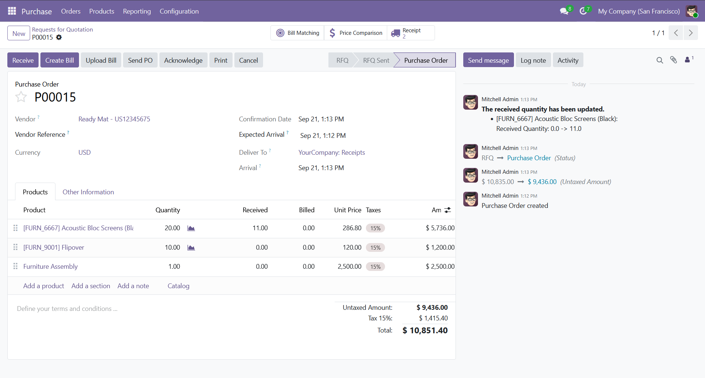
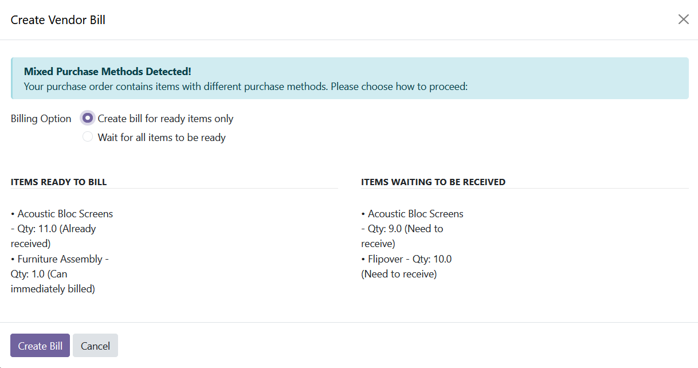
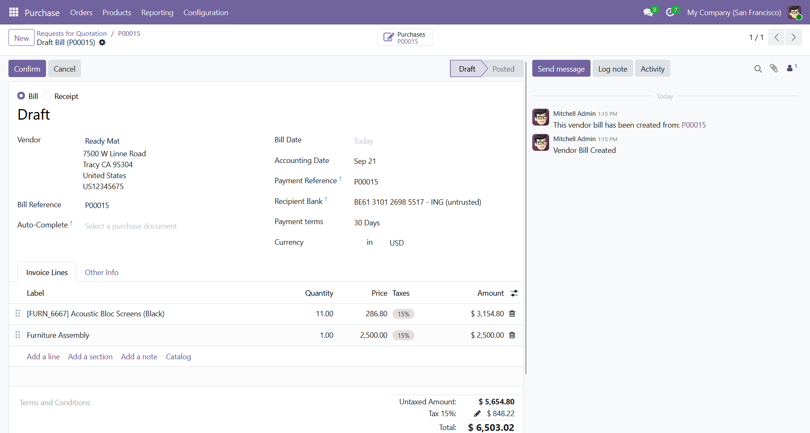

# Purchase Create Vendor Bill

## Overview

In Odoo 19, the traditional "Create Vendor Bill" button was replaced with an "Upload Bill" feature. This module **restores the classic Create Vendor Bill functionality** with enhanced intelligence that respects different purchase methods.

*Perfect for businesses that prefer creating bills directly from purchase orders rather than uploading external bills.*

## ✨ Key Features

### 🎯 **Smart Purchase Method Detection**
- **Purchase Method = "Purchase"**: Bills created immediately upon confirmation
- **Purchase Method = "Receive"**: Bills created only after products are received
- **Mixed Scenarios**: Intelligent wizard guides you through the process

### 🧠 **Intelligent Wizard**
When your purchase order contains mixed purchase methods, a smart wizard appears with:
- **Clear breakdown** of items ready to bill vs. items waiting for receipt
- **Flexible options**: Create partial bills or wait for all items
- **User-friendly interface** with visual feedback

### 🚀 **Enhanced User Experience**
- **One-click billing** for straightforward scenarios
- **Guided workflow** for complex mixed-method orders  
- **Prevents errors** by validating quantities and states
- **Seamless integration** with existing Odoo purchase workflow

## 📸 Screenshots

<!-- Placeholder for screenshots -->
*[Screenshot 1: Create Bill button in Purchase Order]*

*[Screenshot 2: Smart wizard for mixed purchase methods]*

*[Screenshot 3: Generated vendor bill]*

## 🔧 How It Works

### Scenario 1: All products with "Purchase" method
- ✅ Click "Create Bill" → Instant bill creation
- Bills entire ordered quantities immediately

### Scenario 2: All products with "Receive" method (fully received)
- ✅ Click "Create Bill" → Instant bill creation  
- Bills received quantities only

### Scenario 3: Mixed methods or partial receipts
- 🧙 Smart wizard appears automatically
- Shows clear breakdown of ready vs. waiting items
- Choose: "Create bill for ready items" or "Wait for all items"

## 📋 Use Cases

- **Service Companies**: Bill services immediately (purchase method)
- **Product Resellers**: Bill only after receipt confirmation (receive method)  
- **Mixed Operations**: Handle both scenarios intelligently
- **Compliance**: Maintain proper purchase-to-pay workflows

## 🛠️ Installation

1. Download the module from Odoo Apps Store
2. Install through Apps menu: Search "Purchase Create Vendor Bill"
3. No additional configuration required
4. The "Create Bill" button appears automatically on confirmed purchase orders

## 💼 Business Benefits

- **Faster Processing**: Direct bill creation without file uploads
- **Better Control**: Quantity validation and purchase method compliance
- **Reduced Errors**: Automated quantity calculations and validations
- **Improved Workflow**: Seamless integration with existing purchase processes
- **User Adoption**: Familiar interface for users migrating from older Odoo versions

## 🔐 Permissions

The module automatically grants access to:
- **Purchase Users**: Can create vendor bills from their purchase orders
- **Purchase Managers**: Full access to all purchase bill creation features

## ⚙️ Technical Details

### Dependencies
- `purchase`: Base Purchase Management module
- `account`: Accounting module for vendor bill management

### Compatibility
- **Odoo Version**: 19.0 Community & Enterprise
- **Database**: PostgreSQL
- **Browser**: All modern browsers supported

### Data Integrity
- Respects existing `qty_invoiced` to prevent double billing
- Validates `qty_received` for receive-method products
- Maintains audit trails and accounting consistency

## 🐛 Known Limitations

- Products must be properly configured with appropriate purchase methods
- Requires proper receipt processing for "receive" method products
- Module designed for standard purchase workflows

## 📞 Support & Updates

For support, feature requests, or bug reports, please contact the module author through the Odoo Apps Store.

## 📄 Changelog

### Version 19.0.1.0.0 (Initial Release)
- ✅ Restore Create Vendor Bill functionality
- ✅ Smart purchase method detection
- ✅ Intelligent wizard for mixed scenarios  
- ✅ Seamless Odoo 19 integration
- ✅ Comprehensive error handling

---

**Transform your purchase-to-pay process with intelligent vendor bill creation. Download now and experience the power of automated, intelligent billing!**